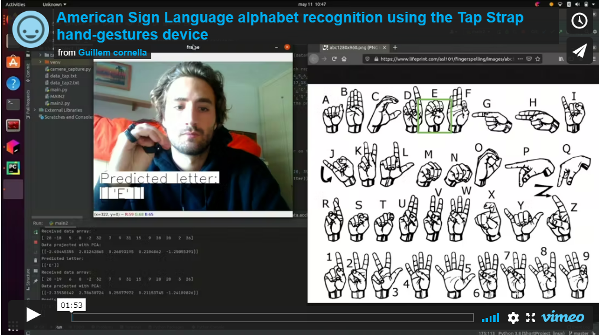
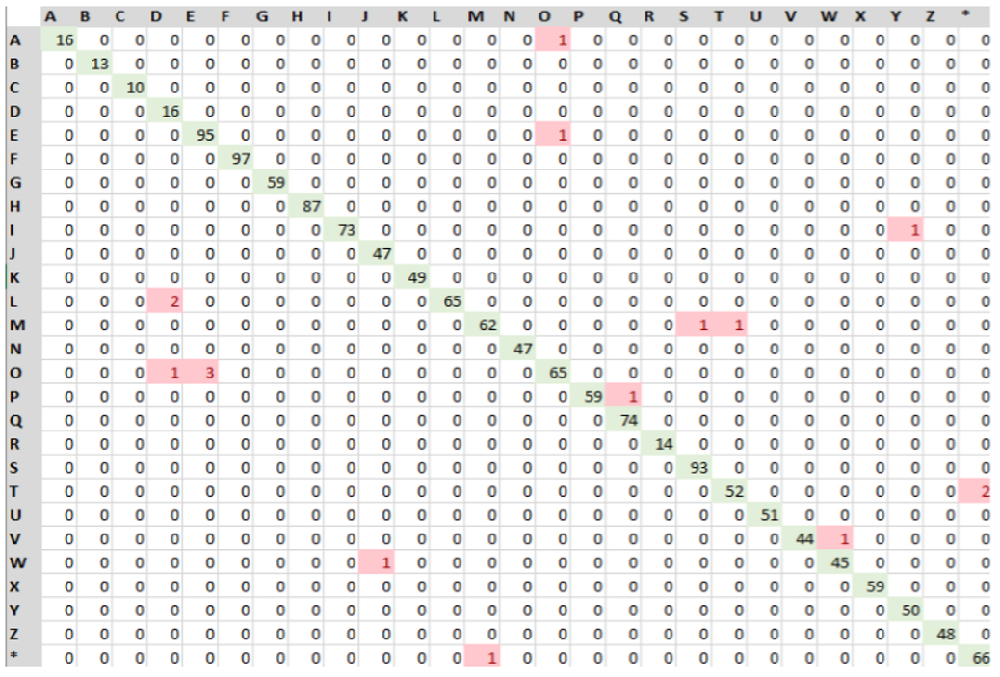

# TapStrap2-Hand-Gesture-Recognition-

The aim of this project is to present the Tap Strap hand-gestures device as an American Sign Language alphabet interpreter, by applying Machine Learning and Pattern Recognition techniques. A dimensionality reduction of the data set has been performed by PCA. Then, four classifiers have been trained using different techniques: LDA, QDA, SVM and Random Forest. Finally, the performance analysis of each classifier has been carried out, considering precision indices and time performances of the process of training and classification. 

The results obtained lead to the conclusion that for the scope of this project, SVM tends to be a more complete classifier. In addition to this, a Python script has been designed to test the alphabet recognition in real time in Ubuntu, with very good results.

The performance and the accuracies of the classifiers are very good, in fact all the methods perform similarly. However, the best classifier is SVM with 5 components, achieving 99.18% of accuracy. From the confusion matrices and performance scores we can validate that there are few errors and few incorrectly detected classes.

REFERENCES
- [1] Christopher M Bishop. Pattern recognition and machine learning. springer, 2006.
- [2] TapWithUs. TapWithUs/tap-python-sdk. Mar. 2021. URL: https://github.com/TapWithUs/tap-python-sdk.
